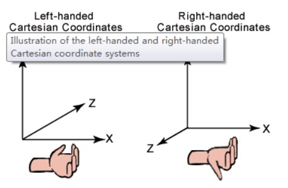
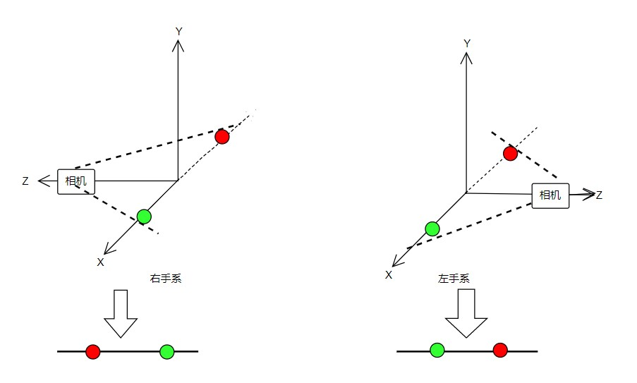

# 左手系与右手系
### 定义：
简单来说，左手系与右手系的区别就是计算向量叉乘时是用左手还是右手来判断方向

### 差别：
OpenGL使用的是右手系，Direct3D使用的是右手系;Blender、C4D、Maya导出的模型均为右手坐标系；Unity、U4D导出的模型均为左手坐标系,其差别体显在几个方面
> **正向旋转方向**:
> 在右手系中，正向旋转方向为逆时针，而在左手系中，正向旋转方向
> 为顺时针

> **叉积方向**:
> 在右手系中，用右手判断，左手系中，用左手判断

> **MVP变换**:
> * 对于世界坐标系，左手系与右手系都描述的是同样的物体，因此
> 不会有影响，也就是model变换没有差别
> * 但是对于view变换就不同了，比如下面的例子:
> 在(3,0,0)有一个绿色的点，在(-3,0,0)有一个红色的点,相机
> EyePos(0, 0, 15), LookAt(0, 0, 0), UpVec(0, 1, 0)
> 
> 可以看到左手系和右手系得到了左右相反的结果
## 转化：
> **坐标**:
>由上述view变换的例子可知，要想左手系与右手系得到相同的结果，
>只需将点的x值取负即可，也就是说