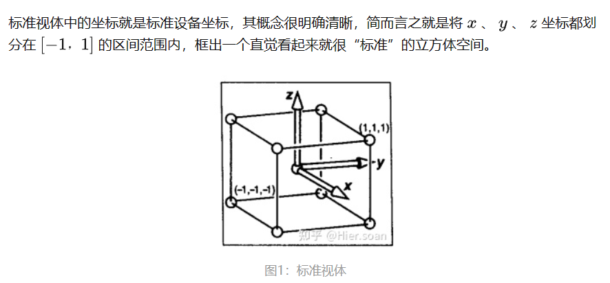
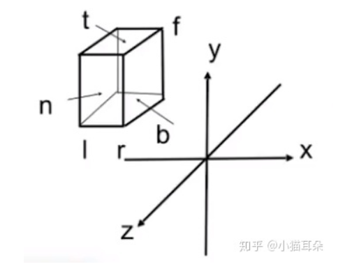
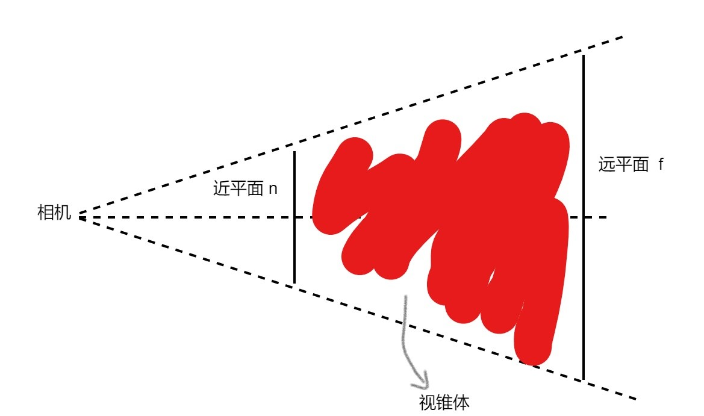
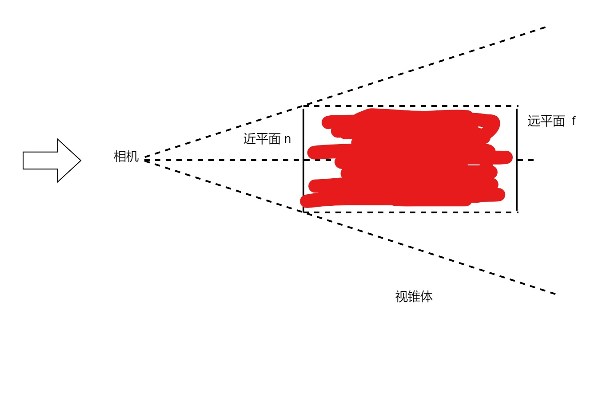
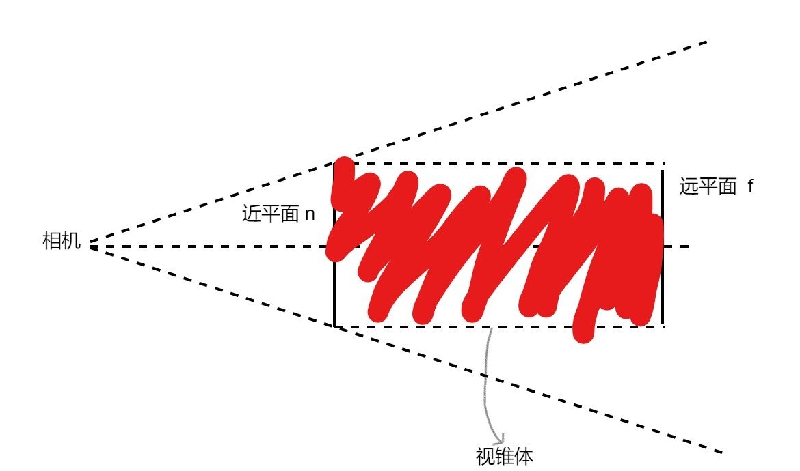
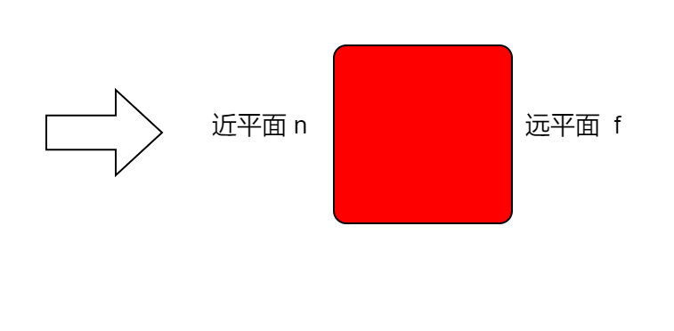
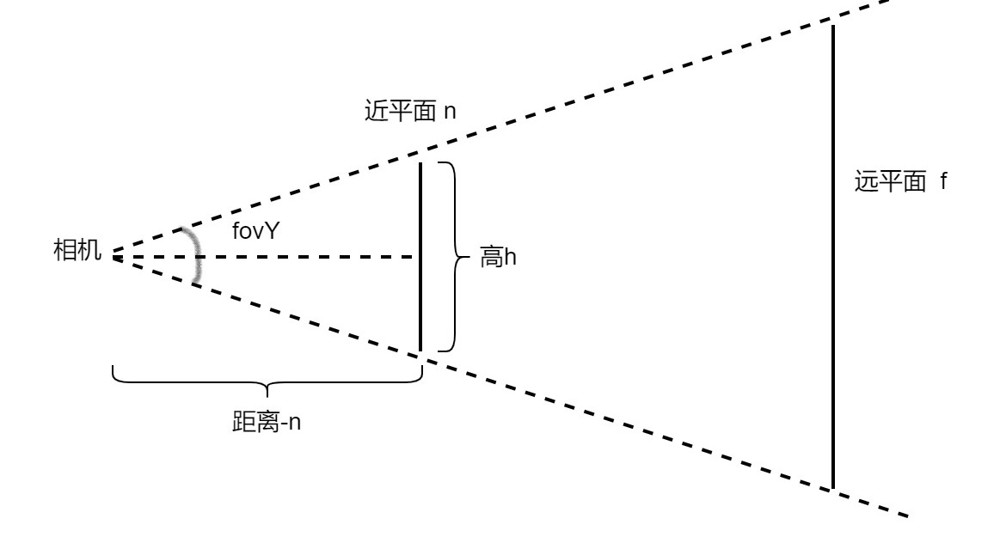
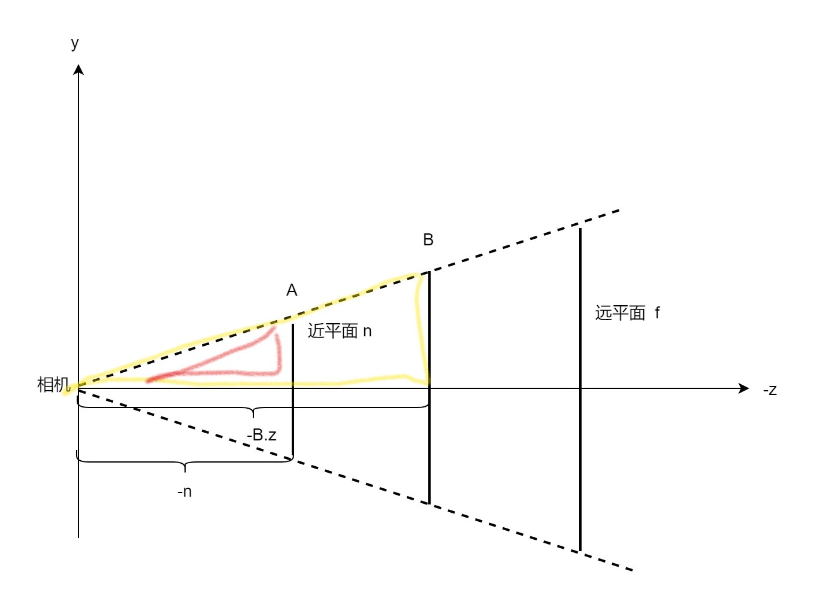
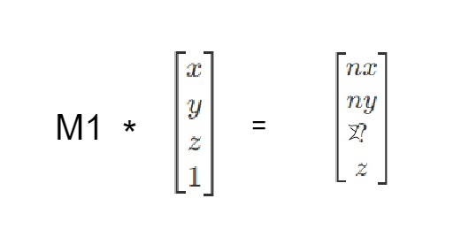
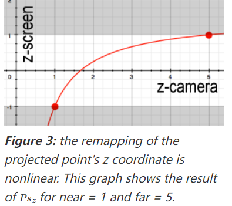

## 正交投影矩阵
正交投影将视图空间中的物体投影到NDC空间中

首先我们确定投影的范围:一个长方体视锥体，由六个参数确定
左(l),右(r) 上(t),下(b) 前(n)，后(f)

然后将该长方体视锥“压成”NDC空间的标准立方体，只需两步即可

> 1.平移到原点
> 首先将长方体视锥体中心点平移到原点，根据上述六个参数很容易推导出平移
> 矩阵
> $$
>    \left[
>    \begin{matrix}
>     1 & 0 & 0 & -(l+r)/2\\
>     0 & 1 & 0 & -(t+b)/2\\
>     0 & 0 & 1 & -(n+f)/2\\
>     0 & 0 & 0 & 1
>    \end{matrix}
>    \right]
> $$ 

> 2.缩放为标准立方体
> 同样根据上述六个参数很容易得到缩放矩阵，就是把长宽高由(r-l),(f-n),(t-b)都
> 变为2,在求边长时注意参数的符号
> $$
>    \left[
>    \begin{matrix}
>     2/(r-l) & 0 & 0 & 0\\
>     0 & 2/(t-b) & 0 & 0\\
>     0 & 0 & 2/(n-f) & 0\\
>     0 & 0 & 0 & 1
>    \end{matrix}
>    \right]
> $$ 

最后将上述两个矩阵组合得到最终的正交投影矩阵
> $$
>    \left[
>    \begin{matrix}
>     2/(r-l) & 0 & 0 & -(r+l)/(r-l)\\
>     0 & 2/(t-b) & 0 & -(t+b)/(t-b)\\
>     0 & 0 & 2/(n-f) & -(n+f)/(n-f)\\
>     0 & 0 & 0 & 1
>    \end{matrix}
>    \right]
> $$ 

## 透视投影矩阵
同样，透视投影将视图空间中的物体投影到NDC空间中，这一过程可以拆分为两步，也就是说，透视投影矩阵可以理解为进行了两个操作:

1.将视锥体内的点投影到近平面，具体来说是将点的x,y值投影到近平面，z值随之改变。可以形象的理解为将视锥体“压缩”成一个以近平面为其中一面的长方体

2.将上一步得到的所有点变换到NDC空间中，可以形象的理解为将上一步得到的长方体经过平移，缩放变为了标准立方体

#### 推导：
对于一个透视投影矩阵，往往需要以下几个参数来构造：
* 远，近平面的z坐标f,n(也可以是距离，这里采用坐标)
* 相机的视角，一般为y轴视角(fovY)
* 近平面的宽高比aspect
> 首先，根据fovY与aspect推导出近平面大小
> 
> 根据几何关系，容易得出h = 2*(-n)*tan(fovY/2)
> 然后根据宽高比即可得出宽w = h * aspect
 
对于推导过程，参考games101(本来是想用其他方法推导，但看了一些后发现games101的方法逻辑更加清晰，也更容易理解)。上面也提到了，可以将透视投影矩阵的操作分为两步，那么，对于它的推导，可以将上述每一步分别写成一个变换矩阵M1，M2，最后投影变换矩阵**M=M2*M1**
> 对于第一步，根据透视投影的几何关系可以得到投影后的x,y的值
>
> 比如在YoZ平面，对于视锥体内的任意一点B，其在经过透视投影后的y值与
> 近平面上点A的y值相等，根据相似三角形的几何关系: **A.y/-n = B.y/-B.z**
> 变形得到：__A.y= n*(B.y/B.z)__
> 也就是说B点在投影后的纵坐标 __y' = n*(B.y/-B.z)__
> 同理,在XoZ平面根据相同的方法可以得到,B点在投影后的横坐标 
> __x' = n*(B.x/-B.z)__
> 也就是说，对于视锥体内一点(x,y,z),其在投影后的坐标为(nx/z,ny/z,?)，这
> 里先不考虑z值的变化。写成齐次坐标的形式就是(x,y,z,1)变为(nx/z,ny/z,?,1)
> 而(nx/z,ny/z,?,1)又可以写成(nx,ny,z?,z), **即(x,y,z,1)在左乘矩阵M1后等于
> (nx,ny,z?,z)**
> 
> 很容易得到M1的一，二，四行
> $$
>    \left[
>    \begin{matrix}
>     n & 0 & 0 & 0\\
>     0 & n & 0 & 0\\
>     ? & ? & ? & ?\\
>     0 & 0 & 1 & 0 
>    \end{matrix}
>    \right]
> $$ 
> 然后对于第三行，它用来计算投影后的z值，x,y值并不参与对于z值的投影计算，所以第三行的前两个数都为0，对于后两个数可以设为A,B，然后找关于
> A,B的两个方程。
> $$
>    \left[
>    \begin{matrix}
>     n & 0 & 0 & 0\\
>     0 & n & 0 & 0\\
>     0 & 0 & A & B\\
>     0 & 0 & 1 & 0 
>    \end{matrix}
>    \right]
> $$ 
> 我们关注两个特殊的点，近平面的中心点  __(0,0,n)__ 与远平面的中心点 __(0,0,f)__，这两个中心点在投影之后坐标是不改变的,也就是说,即这两个点的齐次坐标 
> __(0,0,n,1)__,__(0,0,f,1)__ 在左乘M1矩阵后仍为 __(0,0,n,1)__,__(0,0,f,1)__
> __(0,0,n,1)__,__(0,0,f,1)__ 变为了 __(0,0,n * n,n)__ 和 __(0,0,f*f,f)__
> 最后得到M1：
> $$
>    \left[
>    \begin{matrix}
>     n & 0 & 0 & 0\\
>     0 & n & 0 & 0\\
>     0 & 0 & n+f & -nf\\
>     0 & 0 & 1 & 0 
>    \end{matrix}
>    \right]
> $$ 

> 根据第二步，将投影后得到的长方体变换为标准立方体，而这一操作其实与一
> 开始介绍的正交投影效果是一样的，也就是说第二步相当于做了一个正交投影
> 因此M2就等于正交投影矩阵
> $$
>    \left[
>    \begin{matrix}
>     2/(r-l) & 0 & 0 & -(r+l)/(r-l)\\
>     0 & 2/(t-b) & 0 & -(t+b)/(t-b)\\
>     0 & 0 & 2/(n-f) & -(n+f)/(n-f)\\
>     0 & 0 & 0 & 1
>    \end{matrix}
>    \right]
> $$ 

最后，M=M2*M1得到透视投影矩阵
**$$
    \left[
    \begin{matrix}
     2n/(r-l) & 0 & -(r+l)/(r-l) & 0\\
     0 & 2n/(t-b) & -(t+b)/(t-b) & 0\\
     0 & 0 & -(n+f)/(f-n) & 2nf/(f-n)\\
     0 & 0 & 1 & 0
    \end{matrix}
    \right]
 $$**

#### 注意：
> 首先要明确，上述提到的所有变化:正交投影中将长方体平移再缩放为标准立
> 方体，透视投影中先将视锥体压缩为长方体在由长方体平移缩放得到标准立方
> 体,都是针对三维空间而言而不是四维的齐次坐标空间，我们根据是这变化将三
> 维坐标转化为四维齐次坐标然后推导出了4x4的矩阵。
>
> 拿透视投影来说，首先我们将视锥体内所有的点转化为齐次坐标后左乘M1得到
> 透视后的结果，此时的结果是一个四维齐次空间的几何体，将所有点的齐次坐
> 标再变回三维坐标后，才会得到三维空间中我们将视锥体压缩后的长方体。对
> 于M2同理，在左乘M2后将所有点的坐标变回三维坐标才会得到标准立方体。
>
> 也就是说，对于透视投影矩阵，所有点在左乘透视投影矩阵后得到的是一个四
> 维空间的几何体(__这其实就是裁剪空间__),然后将所有点除第四维的值得到对应的
> 三维坐标后(这一步除法就是 __透视除法__)，我们才会得到NDC空间中投影后的结
> 果

> 回过头来看透视投影矩阵，一一个点的x,y值是根据透视的几何关系得到的，
> 而z值我们是根据两个特殊点推到的投影矩阵，我们用投影矩阵来看一下对于任
> 意一个点的z值变化,根据投影矩阵
> 这一变化是非线性的，对应的图像如图
> 
> 根据图像，离近平面越近的点投影后的z值变化越大，而离远平面越近的点投影
> 后z值变化越小，这就可能导致 __Z-fighting__，即离远平面特别近的点，因为它们
> 在投影后的z值差异非常小,原本投影后z值不同的一些点可能就会因为浮点数近
> 似而导致它们投影后的z值相同,影响后面的深度测试
>
> 为了尽量避免Z-fighting，远近平面的距离不宜过大
> 
## 参考
* <https://zhuanlan.zhihu.com/p/554093703>
* <https://zhuanlan.zhihu.com/p/122411512>
* <https://www.scratchapixel.com/lessons/3d-basic-rendering/perspective-and-orthographic-projection-matrix/opengl-perspective-projection-matrix.html>